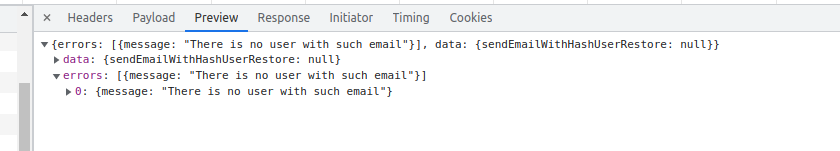

# Error Handling

By default Api platform returns "Internal server error" message for Graphql queries. To handle errors, custom exceptions should implement `App\Exception\AppExceptionInterface`

```php
<?php

declare(strict_types=1);

namespace App\Exception;

use Exception;

final class ItemExistsException extends Exception implements AppExceptionInterface
{
}
```

In this case it will return error in the following format:



:::tip under the hood logic implemented in the `App\Api\Serializer\Exception\ExceptionNormalizer` class

:::
